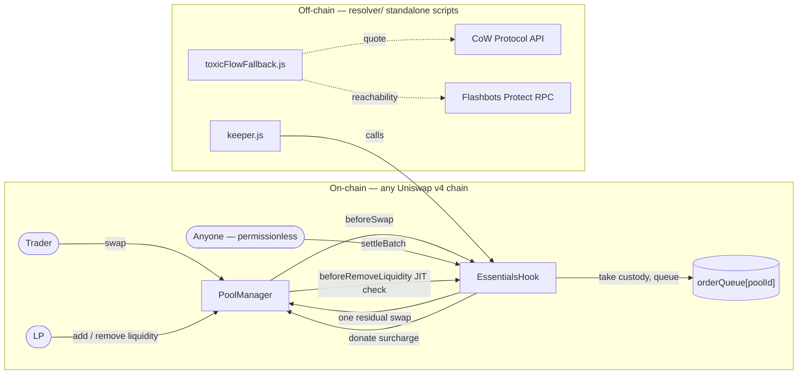
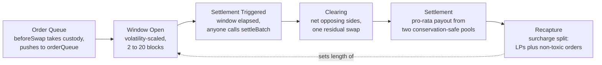
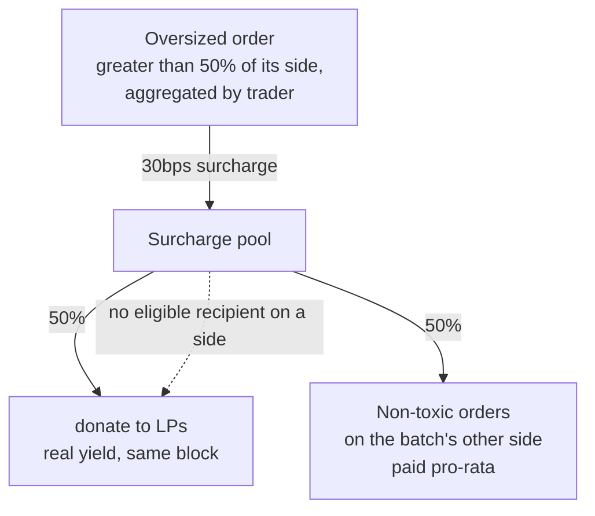
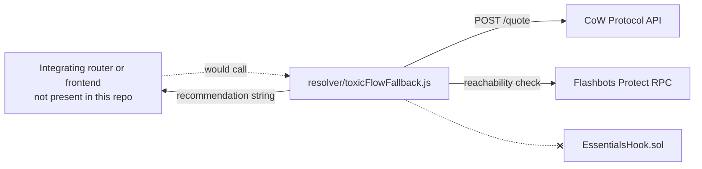

# Essentials

**A Uniswap v4 hook that batch-clears swaps at a single uniform price, deters JIT liquidity, and recaptures value to LPs instead of searchers.**

**Not just "MEV protection."**

**Victim-restorative MEV capture via on-chain batch settlement.**

[Demo Video](https://youtu.be/z3ysnrBqJ1A?si=HHRuSSdD1WSNYB1n)
[Slide](https://gamma.app/docs/ESSENTIALS--v3yb0z4zwz495wp)

**Partner integrations:** CoW Protocol API and Flashbots Protect RPC, via a standalone off-chain script (`resolver/toxicFlowFallback.js`) — not wired into on-chain execution. See [CoW Protocol / Flashbots fallback](#cow-protocol--flashbots-fallback) below for exactly what this does and doesn't do.

---

## The problem

On a normal AMM, every trade is a visible, sequenced event: a sandwich bot can front-run it, and a JIT bot can snipe its fee with zero real capital risk. Both exploit the same thing — **ordering**. Essentials removes ordering from the equation: every order in a batch clears at the exact same price, so there's no "before" and "after" position left to exploit.

**Who benefits:** swappers get a fair, undistorted fill instead of a sandwich tax; LPs get a real share of the value that would otherwise leak to a searcher (measured, not assumed — see below); the pool becomes a self-contained "fair-flow" venue with no off-chain solver dependency required for its core guarantee.

## What's actually novel here

The underlying idea (uniform-price batch clearing) is CoW Protocol's; deferred/netted settlement is TWAMM's. What this project adds:

- A **self-contained v4 hook** implementation — no off-chain solver network required for the core sandwich-neutralization guarantee.
- A **volatility-scaled batch window** (2–20 blocks, scaled off realized price movement) — genuinely implemented and tested, not just described.
- **Trader-aggregated toxic-order detection** with a recapture split between LPs and the batch's smaller participants, closing the naive per-order-only evasion found during an internal audit.
- A real, working (if standalone) CoW Protocol / Flashbots Protect fallback script — not wired into the contract, but functional.

---

## Architecture



---

## How the hook works

### 1. Batch clearing

`beforeSwap` intercepts every swap instead of letting it execute instantly: it takes custody of the input token (`manager.take()`), returns a fully-offsetting delta so the pool's own curve is never touched, and pushes the order into `orderQueue[poolId]`. A batch is capped at `MAX_BATCH_SIZE` orders. Once the window elapses, anyone can call `settleBatch()` (permissionless by design — no single party is a liveness dependency). Settlement then:

1. **Nets opposing sides directly** — orders selling token0 are matched against orders selling token1 with no pool contact needed for the matched portion.
2. **Executes exactly one residual swap** for the imbalance.
3. Uses that swap's real, executed price (not the requested amount) to pay every participant pro-rata from two conservation-safe pools, so payment can never exceed what was actually taken in.

### 2. Volatility-scaled delay

After each settlement, `_nextWindow()` compares how far the price moved against the pool's last observed tick and sets the **next** batch's window accordingly — wider (up to `MAX_WINDOW_BLOCKS`) after a volatile settlement, narrower (down to `MIN_WINDOW_BLOCKS`) after a calm one. This is real, tested logic, not a fixed timer.

### 3. LP recapture

An order that's more than 50% of its side's volume — aggregated by trader address across the batch, not judged per-order in isolation — is charged a surcharge (`TOXIC_SURCHARGE_BPS`). That surcharge splits `LP_RECAPTURE_SHARE_BPS` to LPs via `donate()` and the rest to the batch's non-toxic orders on the other side, pro-rata, in the currency they actually wanted. If a side has no eligible recipient, its share is folded into the LP donation instead of sitting stranded.

### Inside one settlement



**Order queue** (what `orderQueue[poolId]` actually holds mid-batch):

```
ORDER QUEUE                                   block 21 · window 2/2
────────────────────────────────────────────────────────────────
 ● sell TKN0   0x9cb2…6b74      20.00 TKN0        [ TOXIC +30bps ]
 ● sell TKN0   0x1d7d…3811       5.00 TKN0
 ● sell TKN1   0x9cb2…6b74      20.00 TKN1        [ TOXIC +30bps ]
────────────────────────────────────────────────────────────────
 3 orders queued · settles once block > startBlock + windowBlocks
```

**JIT liquidity lock** (`beforeRemoveLiquidity`, keyed by pool + caller + tick range + salt):

```
JIT LIQUIDITY LOCK
────────────────────────────────────────────────────────────────
 position added        block 18,204,109
 cooldown               2 / 3 blocks (JIT_LOCK_BLOCKS)
 status                 removeLiquidity() reverts: JitCooldownActive
```

**Recapture split:**



### CoW Protocol / Flashbots fallback

`resolver/toxicFlowFallback.js` is a **real, standalone Node script** — it makes a genuine `POST /quote` call to CoW Protocol's live API and checks Flashbots Protect RPC reachability. Stated plainly: **it is not called by `EssentialsHook.sol`, and there is zero on-chain reference to either service.** It exists as a reference implementation of the fallback check a router or frontend *could* call before deciding to queue an order — wiring it into an actual routing decision is integration work this repo doesn't include.



---

## Proof, not just a claim

```bash
forge test -vv
```

|                                             | Vanilla pool                    | Essentials-hooked pool          |
| ------------------------------------------- | ------------------------------- | ------------------------------- |
| Same front-run → victim → back-run sequence | **+0.0270 ETH** attacker profit | **−0.1322 ETH** attacker *loss* |

`JitBotEconomics.t.sol`: a standing LP earns **100%** of a trade's fee alone, **25%** once a JIT bot (3x the baseline's liquidity) participates — a **7,500 bps** fee-dilution, isolated directly from `PoolManager.modifyLiquidity`'s `feesAccrued` return value.

`AuditFindings_ToxicSplitEvasion*.t.sol`: an internal audit found the original per-order toxic check could be evaded by splitting one large order into several same-address pieces (cut the deterrent penalty by ~11x). The fix (trader-aggregated detection) restores the full penalty for that case — verified to exactly match the undivided baseline post-fix. True multi-address Sybil evasion remains an open, generally-unsolved on-chain problem and is documented as such, not fixed.

### Test suite

71 tests across 10 files — unit, integration, fuzz, stateful invariant, and audit-finding regression tests:

```bash
forge test              # full suite
forge test -vv          # with the numbers above printed
```

| File                                                   | Focus                                                                        |
| ------------------------------------------------------ | ---------------------------------------------------------------------------- |
| `EssentialsHook.t.sol`                                 | Core mechanism, sandwich comparison, JIT lock, volatility scaling, recapture |
| `EssentialsHookUnit.t.sol`                             | Every constant, error branch, view accessor, hookData-decoding path          |
| `EssentialsHookIntegration.t.sol`                      | Multi-order/multi-batch/multi-pool scenarios, conservation                   |
| `EssentialsHookFuzz.t.sol`                             | Property-based checks across random amounts/directions                       |
| `EssentialsHookInvariant.t.sol`                        | Stateful invariants across long random call sequences (Handler-based)        |
| `JitBotEconomics.t.sol`                                | JIT fee-dilution, quantified                                                 |
| `AuditFindings_ReentrancyGuard.t.sol`                  | Reentrancy fix, verified with a malicious token PoC                          |
| `AuditFindings_BatchSizeCap.t.sol`                     | Unbounded-batch DoS fix, gas measured empirically                            |
| `AuditFindings_ToxicSplitEvasion.t.sol` / `_Fix.t.sol` | Splitting evasion found, then fixed and re-verified                          |

---

## Setup

```bash
make install   # installs Foundry (if missing) + forge libs + resolver deps
make test      # run the Foundry test suite
```

Or step by step: `forge install && forge test -vv`.

### Demo — a real local chain, not a test log

```bash
./script/demo/run_local_demo.sh
```

Deploys everything to a fresh local `anvil` instance, submits a real front-run + victim swap + back-run as three separate transactions, mines the chain forward past the batch window, settles it, and prints the attacker's real loss and the victim's real fill straight from on-chain balances.

### Interact with a live deployment

```bash
make status HOOK=0x.. TOKEN0=0x.. TOKEN1=0x.. RPC_URL=...
make queue-swap HOOK=.. TOKEN0=.. TOKEN1=.. ZERO_FOR_ONE=true AMOUNT_IN=1000000000000000000 RPC_URL=.. PRIVATE_KEY=..
make settle HOOK=.. TOKEN0=.. TOKEN1=.. RPC_URL=.. PRIVATE_KEY=..
```

`script/Interact.s.sol` also exposes `addLiquidity` / `removeLiquidity`. Full target list: `make help`.

Deploy: `make deploy POOL_MANAGER=<address> RPC_URL=<url> PRIVATE_KEY=<key>`.

---

## Limitations & Future Improvements

- **Queue visibility before settlement.** Orders and `OrderQueued` events are public for the entire batch window. This protects against sandwiching *within* a settlement (no ordering advantage once queued) — it does not hide the queue's existence or contents from someone watching before settlement happens. Closing that fully needs off-chain infrastructure this project deliberately doesn't depend on for its core guarantee.
- **Batch settlement adds latency.** Swappers wait 2–20 blocks (volatility-scaled) instead of instant confirmation — a real UX cost traded for the protection, not a free lunch.
- **Thin pools remain a risk for permissionless, timed settlement.** `settleBatch()` is callable by anyone at a time of their choosing; on a thin pool the clearing price for the *entire batch* derives from spot price + one residual swap at that moment.
- **Sybil evasion of toxic detection is unsolved.** The fix aggregates by trader *address*; a determined attacker rotating addresses is a generally hard, unsolved on-chain problem.
- Exact-input swaps only; no per-order slippage revert inside a batch (would reintroduce the ordering games this hook removes); `sender` in `beforeSwap` is the calling router, not the end user — routers must pass `abi.encode(trueSwapper, minAmountOut)` as `hookData`.
- Wire the CoW/Flashbots fallback into actual routing, not just a standalone comparison script.

---

## Project layout

```
src/EssentialsHook.sol         — the hook
src/base/BaseHook.sol          — self-contained base-hook pattern
src/libraries/CurrencySettler.sol
test/                          — 71 tests (see table above)
script/DeployEssentialsHook.s.sol — deploy to base sepolia testnet 
script/Interact.s.sol          — status / queueSwap / settle / liquidity, against any deployment
script/demo/                   — live sandwich demo on a real local chain
resolver/                      — off-chain keeper + CoW/Flashbots fallback script
Makefile                       — make install / test / demo / status / settle / deploy
```
